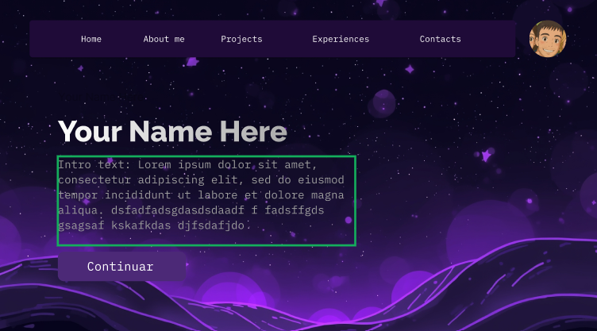
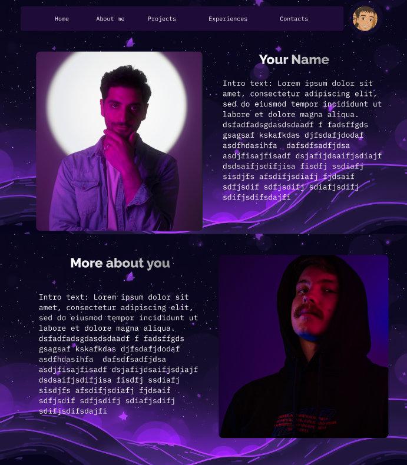
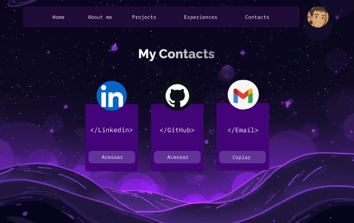
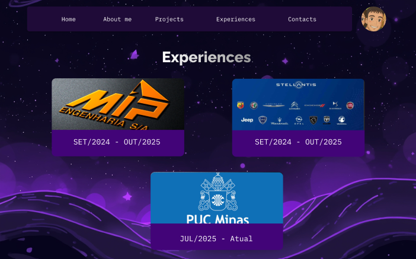
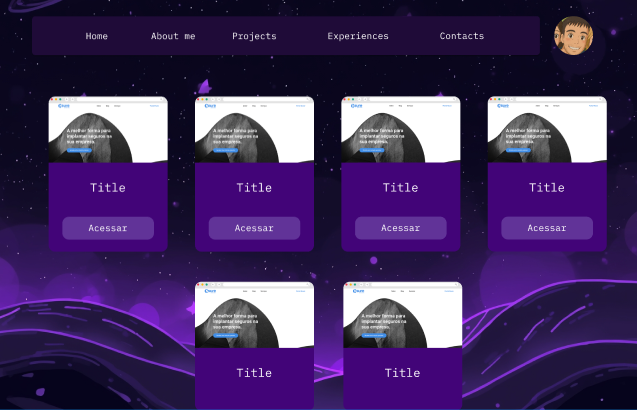

# 📂 Portfolio_Lab_Software

O objetivo deste projeto é desenvolver um **website de portfólio profissional** para apresentar a trajetória, habilidades, projetos e formas de contato de maneira **moderna, responsiva e acessível**.  
O design será inspirado em um **tema escuro**, utilizando as cores **roxo**, **preto** e **branco**, transmitindo **sofisticação e personalidade**.


## 🚀 Tecnologias Utilizadas
- **[React](https://react.dev/)** → Biblioteca JavaScript para construção de interfaces
- **[Vite](https://vitejs.dev/)** → Ferramenta de build rápida e moderna
- **[TypeScript](https://www.typescriptlang.org/)** → Superset do JavaScript com tipagem estática

## 📦 Dependências
- **react** e **react-dom** → Núcleo do React
- **typescript** → Tipagem para JavaScript
- **react-icons** → Ícones prontos para uso
- **react-router-dom** → Implementação de roteamento em aplicações web

## 🛠 Frameworks e Bibliotecas
- **React Icons** para ícones de redes sociais e tecnologias
- **EmailJS** para formulário de contato funcional sem backend

## 📂 Estrutura do Projeto
Segue a parte refeita do README, já formatada corretamente e mais organizada para manter um padrão profissional:

markdown
## 📂 Estrutura do Projeto

````
src/
├─ assets/        → imagens, ícones e arquivos estáticos
├─ components/    → componentes reutilizáveis (Navbar, Footer, Buttons)
├─ sections/      → seções principais do site (Home, About, Projects, Contact)
├─ styles/        → configurações e estilos globais
├─ App.tsx        → ponto principal da aplicação
├─ main.tsx       → renderização principal
└─ index.css      → configuração do Tailwind CSS

````

## 🖥 Instruções de Instalação e Execução

1. **Clonar o repositório**
```bash
git clone https://github.com/SEU_USUARIO/Portfolio_Lab_Software.git
cd Portfolio_Lab_Software
````

2. **Instalar as dependências**

```bash
npm install react-router-dom
npm install react-icons
```

3. **Executar o projeto**

```bash
npm run dev
```

4. **Abrir no navegador**

```
http://localhost:5173
```
## 📂 Protótipo Figma






